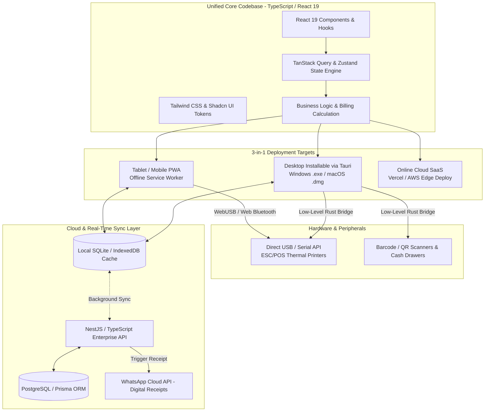
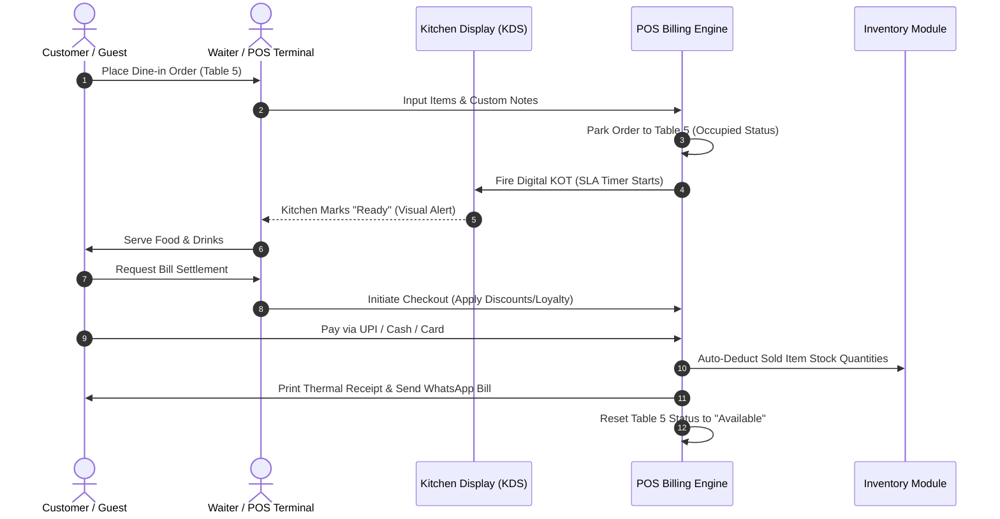
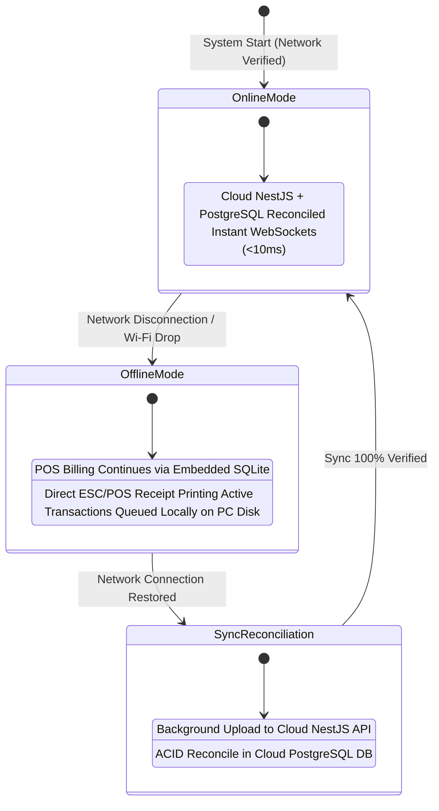

# Product Requirements Document (PRD)
## Karvaan POS – Core Edition

| **Document Version** | **1.0.0** | **Status** | **Live Product / Production** |
| :--- | :--- | :--- | :--- |
| **Product Name** | Karvaan POS Core Edition | **Target Market** | Restaurants, Cafés, Bakeries, QSRs, Food Courts |
| **Platform Architecture** | 3-in-1: Desktop App / PWA / Cloud SaaS | **Tech Stack** | React 19 / TypeScript / Vite / Tauri + NestJS / PostgreSQL |
| **Last Updated** | July 2026 | **Classification** | Core Product Specification |

---

## 1. Executive Summary & Product Vision

### 1.1 Overview
**Karvaan POS Core Edition** is a high-performance, modern Point of Sale (POS) and restaurant operating platform designed specifically for the dynamic needs of food service businesses. Traditional restaurant POS systems are often bloated with complex ERP modules, slow navigation, and heavy hardware requirements. Karvaan Core Edition strips away unnecessary complexity to deliver a streamlined, lightning-fast suite of tools essential for day-to-day hospitality operations.

### 1.2 Product Vision
> *"To empower food service businesses with an intuitive, zero-latency, and resilient operating system that simplifies billing, synchronizes kitchen workflows, and elevates customer hospitality without requiring extensive staff training or continuous internet connectivity."*

### 1.3 Core Differentiators
* **Zero-Latency Billing:** Optimized for high-speed checkout during peak rush hours (< 2 seconds per transaction).
* **Offline-First Resilience:** Uninterrupted billing, order printing, and table management even during complete network outages, with automatic background cloud synchronization upon reconnection.
* **Zero-Install QR Ordering:** Frictionless table-side ordering for guests via smartphone browser without downloading app binaries.
* **Modular Simplicity:** Clean, visual, and highly responsive user interface designed for cashiers, waiters, and kitchen staff with varying technical literacy.

---

## 2. Strategic Objectives & Success Metrics

### 2.1 Business & Operational Objectives
1. **Accelerate Checkout Velocity:** Reduce order entry and payment processing time to minimize customer queues.
2. **Eliminate Kitchen Communication Errors:** Replace paper Kitchen Order Tickets (KOTs) with a synchronized digital Kitchen Display System (KDS).
3. **Prevent Revenue & Inventory Leakage:** Automate stock deductions per order and track every financial transaction with granular staff accountability.
4. **Enhance Table Turnover Rate:** Provide visual table occupancy tracking and quick settlement workflows.
5. **Guarantee Operational Continuity:** Ensure 100% billing availability regardless of local ISP or Wi-Fi reliability.

### 2.2 Key Performance Indicators (KPIs) & Target Metrics

| Metric Category | Success Metric | Baseline / Target Benchmark | Measurement Method |
| :--- | :--- | :--- | :--- |
| **Speed & Performance** | Average Billing Time (Item entry to receipt) | **< 15 seconds** per 5-item bill | System transaction timestamps |
| **Kitchen Efficiency** | KOT Routing & Display Latency | **< 500 milliseconds** | Time from POS submit to KDS render |
| **Reliability** | Offline Sync Success Rate | **99.99%** data consistency | Automated sync auditing logs |
| **System Uptime** | Application Availability | **99.9%** (100% locally) | Client-side error reporting |
| **User Adoption** | New Staff Onboarding Time | **< 15 minutes** to standalone billing| Manager onboarding assessment |
| **Inventory Accuracy** | Theoretical vs. Physical Stock Variance | **< 2% variance** across core ingredients| Daily stock audit reports |

---

## 3. Technology Stack & System Architecture

Karvaan POS Core Edition is engineered using a **Unified 3-in-1 Modern Engineering Stack (React + Vite + Tauri + PWA)**. This architecture allows a single TypeScript codebase to be compiled into three distinct deployment targets required by modern enterprise food businesses:
1. **Desktop Installable App (.exe / .dmg / .deb):** High-speed billing terminal software powered by **Tauri**, providing native OS performance, tiny file size (~10 MB), and direct low-level hardware USB/Serial port access.
2. **Offline-Capable PWA (Progressive Web App):** Touchscreen-optimized tablet app for Waiters and Kitchen KDS displays with background offline synchronization via Service Workers and IndexedDB.
3. **Online Cloud-Deployable Web App:** Instant zero-install browser app hosted on cloud edge platforms (Vercel / Cloudflare) for customer table-side QR ordering and owner management portals.

### 3.1 Frontend Web & Desktop Stack (React 19 + Vite + Tauri + PWA)
* **Core Framework:** **React 19 with TypeScript** – The undisputed industry standard for enterprise web applications, ensuring type-safe financial calculations, zero-bug currency handling, and massive developer ecosystem support.
* **Build Tooling:** **Vite** – Next-generation frontend tooling delivering sub-second Hot Module Replacement (HMR), optimized production bundling, and instantaneous builds.
* **Desktop App Compiler:** **Tauri (Rust-Based)** – Bundles React into a lightweight native desktop binary (**~10 MB vs. ~150 MB in Electron**), consumes 80% less RAM on restaurant hardware, and provides secure Rust APIs for direct USB/Serial printer communication without browser security prompts.
* **Styling & UI System:** **Tailwind CSS + Shadcn UI** – Utility-first CSS combined with accessible, high-performance UI components (Lucide icons, Glassmorphism modals, dark/light theme tokens, and responsive grid layouts).
* **State & Data Fetching:** **Zustand** for lightweight global POS cart state and **TanStack Query (React Query)** for asynchronous API data caching, optimistic updates, and offline mutation queues.

### 3.2 Data Storage & Offline-First Resilience
* **Desktop Terminal Database:** **Embedded SQLite (via Tauri Rust bridge)** for lightning-fast local relational queries of 10,000+ menu items, offline transaction storage, and instant customer search.
* **Browser / Tablet PWA Database:** **IndexedDB (via Dexie.js / TanStack Query offline persistence)** for offline caching on waiter tablets and KDS displays.
* **Sync Engine:** Automatic background synchronization that reconciles local SQLite/IndexedDB transaction queues with the cloud database via optimistic concurrency control as soon as internet connectivity is restored.

### 3.3 Backend Cloud & Real-Time Enterprise Stack (NestJS + PostgreSQL)
* **Core Backend Framework:** **NestJS (TypeScript)** – The gold-standard enterprise modular framework. Mirrors our PRD domain architecture cleanly (`BillingModule`, `KdsModule`, `TableModule`, `InventoryModule`), providing dependency injection, modular encapsulation, and robust security Guards.
* **Database & ORM:** **PostgreSQL + Prisma ORM (or TypeORM)** – The undisputed industry standard for enterprise financial accounting and POS platforms. Why PostgreSQL is essential for Karvaan POS:
  * **ACID Transactional Guarantees:** Ensures 100% data integrity during billing settlements, split-payments, and automated recipe inventory deductions without race conditions or financial ledger discrepancies.
  * **JSONB Power for Food Modifiers:** Uses PostgreSQL's native `JSONB` column types to store flexible menu item customizations, portion sizes, and custom kitchen notes (e.g., *"Half/Full", "Extra Cheese", "No onions"*) without requiring complex, slow relational join tables.
  * **Zero Lock-In Concurrency:** Handles thousands of concurrent terminal heartbeats, KDS status updates, and QR-order submissions during peak restaurant rush hours without table-locking bottlenecks.
  * **End-to-End Type Safety:** When paired with **Prisma ORM**, database schemas generate TypeScript definitions automatically, enabling 100% type sharing between the React 19 frontend and NestJS backend.
* **Real-Time Communication:** **NestJS `@WebSocketGateway` (Socket.io / WS)** – Native, first-class decorators for event-driven bi-directional WebSockets. Instantly broadcasts kitchen KOT orders to KDS screens (<10ms latency) and synchronizes table status changes across all active restaurant devices.
* **Digital Messaging & Integrations:** Direct webhook pipeline with **WhatsApp Cloud API** for automated paperless receipt delivery and scheduled background cron jobs for inventory depletion alerts.

---

## 4. Target Users & Role-Based Access Control (RBAC)

### 4.1 User Personas
* **Restaurant Owner:** Focuses on profitability, macro-level sales analytics, stock valuation, and tax reporting. Requires mobile access to real-time dashboards.
* **Restaurant Manager:** Manages daily operations, staff shifts, table layouts, menu pricing, inventory purchasing, and customer dispute resolution.
* **Cashier:** Stationed at the billing counter. Requires rapid item lookup, split-payment handling, discount application, and receipt printing.
* **Waiter / Server:** Equipped with mobile tablets/smartphones. Takes table-side orders, fires courses to the kitchen, monitors table status, and requests final settlements.
* **Kitchen Staff / Chef:** Operates the KDS touchscreen. Focuses on order preparation timers, special ingredient notes, and marking dishes as ready for pickup.

### 4.2 Permissions & Access Control Matrix

| Module / Action | Admin (Owner) | Manager | Cashier | Waiter | Kitchen Staff |
| :--- | :---: | :---: | :---: | :---: | :---: |
| **Dashboard & Financial KPIs** | 🟢 Full Access | 🟢 View Only | 🔴 No Access | 🔴 No Access | 🔴 No Access |
| **POS Billing (Create/Pay Bills)** | 🟢 Full Access | 🟢 Full Access | 🟢 Full Access | 🟡 Create Order Only| 🔴 No Access |
| **Apply Discounts / Void Bills** | 🟢 Full Access | 🟢 Full Access | 🟡 Up to Limit | 🔴 No Access | 🔴 No Access |
| **Table Management & Transfers**| 🟢 Full Access | 🟢 Full Access | 🟢 Full Access | 🟢 Full Access | 🔴 No Access |
| **KDS (View / Update Status)** | 🟢 Full Access | 🟢 Full Access | 🟢 View Only | 🟢 View Only | 🟢 Full Access |
| **Menu & Price Editing** | 🟢 Full Access | 🟢 Full Access | 🔴 No Access | 🔴 No Access | 🔴 No Access |
| **Inventory (Stock In / Out / Adjust)**| 🟢 Full Access | 🟢 Full Access | 🔴 No Access | 🔴 No Access | 🟡 View Low Stock |
| **Customer CRM & Loyalty** | 🟢 Full Access | 🟢 Full Access | 🟢 Add / Select | 🟢 Add / Select | 🔴 No Access |
| **Staff & Role Management** | 🟢 Full Access | 🟡 View Only | 🔴 No Access | 🔴 No Access | 🔴 No Access |
| **System Reports & Export** | 🟢 Full Access | 🟢 Operational Only| 🔴 Cash Drawer Only| 🔴 No Access | 🔴 No Access |

---

## 5. Core Module Specifications

### 5.1 Executive Dashboard
The primary landing workspace providing instant operational awareness and financial snapshots.
* **Real-Time Metrics Grid:** Live counters for Today’s Gross Sales, Total Order Count, Average Order Value (AOV), and Active Customers.
* **Operational Queue Watch:** Real-time visibility into Orders in Progress, Pending KDS Orders, and Occupied vs. Available Dining Tables.
* **Payment Method Breakdown:** Visual chart representing revenue distribution across **Cash**, **Credit/Debit Card**, and **UPI / QR Payments**.
* **Quick Action Bar:** One-click shortcuts to initiate a New Dine-In Order, Quick Takeaway Bill, or Stock Adjustment.

### 5.2 High-Speed POS Billing Engine
The operational heart of Karvaan POS, optimized for touchscreen terminals and keyboard navigation.
* **Smart Catalog & Search:** 
  * Instant filter-as-you-type product search by name, shortcode, or SKU.
  * Visual category tabs with product images, color-coded tiles, and stock indicators.
  * Barcode scanner integration for packaged goods and retail bakery items.
* **Advanced Order Management:**
  * Multi-item quantity adjustment, custom item notes (e.g., *"Less spicy", "No onions"*), and portion modifiers (e.g., *"Half", "Full"*).
  * **Hold & Resume Order:** Park active orders during payment delays and serve the next customer in queue without losing cart state.
  * **Bill Splitting:** Split bills by item, equal share, or custom amount for group dining.
* **Flexible Checkout & Fiscal Compliance:**
  * Multi-tender payment acceptance (e.g., ₹500 Cash + ₹350 UPI on an ₹850 bill).
  * Automated GST calculation (CGST / SGST / IGST breakdown based on dine-in/takeaway tax rules).
  * Instant receipt generation: Thermal ESC/POS printing (with custom logo and footer) and **one-click WhatsApp digital receipt delivery**.

### 5.3 Visual Table & Floor Management
A responsive interactive map representing the restaurant's physical dining room layout.
* **Dynamic Table Statusing:** Color-coded visual indicators:
  * 🟢 **Available:** Vacant and ready for seating.
  * 🔴 **Occupied:** Active order in progress (displays current bill total and seating duration timer).
  * 🟡 **Reserved:** Booked for upcoming guest arrival.
  * 🔵 **Billed / Waiting Settlement:** Meal finished, bill presented to guest.
* **Table Operations:**
  * **Table Transfer:** Seamlessly move an active order from one table to another (e.g., Table 4 to Table 12).
  * **Table Merging:** Combine multiple tables (e.g., T1 + T2) for large parties under a single consolidated billing folio.
  * **Guest Count Tracking:** Log number of covers per table for accurate Table Turnover and Revenue Per Seat analytics.

### 5.4 Digital Kitchen Display System (KDS)
A dedicated touchscreen interface for kitchen preparation stations, replacing physical paper KOTs.
* **Real-Time Order Cards:** Displays incoming orders instantly with Order Number, Table Number, Waiter Name, Elapsed Wait Time, and specific Item Customizations.
* **SLA Priority Color-Coding:**
  * 🟢 **Green (Normal):** Elapsed time < 10 minutes.
  * 🟡 **Orange (Warning):** Elapsed time between 10–15 minutes.
  * 🔴 **Red (Critical/Delayed):** Elapsed time > 15 minutes (triggers audio chime).
* **Interactive Workflow Actions:**
  * One-touch status progression per item or whole order: `Received` ➔ `Cooking` ➔ `Ready` ➔ `Served`.
  * Instant push notification to the waiter's tablet/phone when an order is marked **Ready for Pickup**.

### 5.5 Centralized Menu & Product Management
* **Item Master Catalog:** Manage Product Name, Description, Category, Pricing, Tax Rates (GST %), and Preparation Time SLAs.
* **Variant & Modifier Engine:** 
  * Support for size variants (e.g., *Coffee: Small ₹80, Medium ₹110, Large ₹140*).
  * Add-on modifier groups (e.g., *Extra Cheese +₹30, Choice of Crust: Thin / Cheese Burst*).
* **Dynamic Availability Toggles:** One-click 86-ing (marking "Out of Stock") from the POS or Menu manager, immediately reflecting across POS billing terminals and customer QR menus.

### 5.6 Automated Inventory & Stock Tracking
* **Automated Recipe/Item Deduction:** Automatically decrements stock quantities upon completed bill settlement (e.g., selling 1 Cappuccino deducts 18g coffee beans and 150ml milk).
* **Stock Operations Workflow:**
  * **Purchase Entry (Stock In):** Record supplier invoices, batch numbers, cost price, and stock intake.
  * **Wastage & Consumption (Stock Out):** Log kitchen spoilage, staff meals, or damaged inventory.
  * **Physical Stock Adjustment:** Periodic reconciliation tools to align recorded stock with actual shelf counts.
* **Automated Low-Stock Alerts:** Visual warnings and notifications when ingredients fall below defined reorder thresholds.
* **Categorized Tracking:** Manage stock across distinct storage zones: *Vegetables, Meats, Dairy, Dry Pantry, Beverages, and Packaging Materials*.

### 5.7 Customer Relationship Management (CRM)
* **Guest Profile Database:** Store Customer Name, Mobile Number, Email, Birthday, and Anniversary dates.
* **Behavioral Analytics:** Track Total Lifetime Spend, Visit Frequency, Favorite Ordered Items, and Average Spend per Visit.
* **Loyalty & Rewards Engine:** Configurable points accumulation (e.g., earn 1 point per ₹100 spent) and automated point redemption during checkout billing.

### 5.8 Zero-Install QR Table-Side Ordering
* **Frictionless Customer Workflow:**
  1. Guest scans table-specific QR Code using native smartphone camera.
  2. Mobile-optimized digital menu renders instantly in browser (No app download required).
  3. Guest browses categories, selects items, specifies instructions, and submits order.
  4. Order routes directly to KDS (or awaits Cashier verification based on restaurant policy).
  5. Waiter delivers freshly prepared items to the assigned table.

### 5.9 Staff & Workforce Management
* **Employee Directory:** Secure profiles for all staff members with assigned roles, contact details, and shift schedules.
* **Rapid Terminal Authentication:** Quick 4-digit PIN access or swipe-card login for cashiers and servers to switch sessions on shared POS hardware in milliseconds.
* **Audit Trail Logging:** Complete historical tracking of sensitive actions (e.g., who voided an item, who applied a manual discount, or who opened the cash drawer without a sale).

### 5.10 Operational Reports & Analytics
* **Sales & Revenue Reports:** Daily, weekly, and monthly gross/net sales summaries with hourly heatmaps showing peak business times.
* **Product Velocity Analytics:** Identify **Best-Selling Items** (high volume/high profit) and **Slow-Moving Items** to optimize menu engineering.
* **Staff Performance Tracking:** Revenue generated per cashier, tables served per waiter, and average order preparation time per kitchen team shift.
* **Tax & Accounting Export:** Clean CSV/Excel export of GST collections (CGST/SGST/IGST reports) ready for chartered accountants and tax filing.

---

## 6. System Workflows

### 6.1 End-to-End Order & Billing Workflow

### 6.2 Offline-First Synchronization Lifecycle

#### 6.2.1 How Offline Mode Works (Do We Install PostgreSQL/NestJS Locally?)
**No, you DO NOT need to install heavy server software (PostgreSQL or Node.js/NestJS) onto the cashier's Windows/macOS desktop computer.** Doing so would make installation difficult for restaurant owners and require heavy server maintenance on standard retail hardware.

Instead, Karvaan POS uses the modern industry-standard **"Embedded SQLite Edge Model"**:
1. **Lightweight Desktop Installer (~10 MB):** The Tauri desktop application (`KarvaanPOS.exe`) includes an ultra-fast, zero-configuration **embedded SQLite database** right inside the app bundle.
2. **While Online:** The desktop app communicates with your cloud **NestJS + PostgreSQL** backend. It mirrors the active menu catalog, prices, table layouts, and GST rates down into its local SQLite database.
3. **When Internet Drops (Offline Mode):** The cashier continues punching bills, opening cash drawers, and printing ESC/POS thermal receipts at full speed. All new orders and transactions are saved directly into the local **SQLite database** on the PC's hard drive.
4. **When Internet Reconnects:** A background synchronization engine silently pushes the queued SQLite transaction logs up to the cloud **NestJS + PostgreSQL** server, automatically reconciling ingredient stock deductions and tax reports without any manual cashier intervention.

---

## 7. Non-Functional Requirements (NFRs)

### 7.1 Performance & Responsiveness
* **Sub-100ms UI Interactions:** All button clicks, modal toggles, and tab switches must respond in under 100 milliseconds.
* **High-Speed Search:** Product catalog search across 1,000+ SKUs must filter and display results in `< 50ms`.
* **Lightweight Bundle:** Total frontend initial load size must remain under **1.5 MB** to ensure instant loading even on low-tier hardware or 4G mobile hotspots.

### 7.2 Security & Data Integrity
* **Role Enforcement:** Strict UI and API-level validation of permissions; unauthorized attempts to void bills or access reports must be blocked and audited.
* **Local Data Encryption:** Sensitive customer details and locally cached transaction data stored in IndexedDB must be protected against unauthorized local script extraction.
* **Sanitization:** Strict prevention of XSS and SQL/NoSQL injection across all custom item notes and customer name inputs.

### 7.3 Reliability & Availability
* **100% Local Uptime:** The billing terminal must never block or crash due to cloud server maintenance, DNS failures, or local internet outages.
* **Crash Recovery:** In the event of accidental browser tab closure or power loss, the POS must restore all active cart contents and unpaid table states immediately upon relaunch from local storage.

### 7.4 Hardware & Platform Compatibility
* **Cross-Platform Access:** Operates seamlessly on Windows, macOS, Linux desktop browsers (Chrome, Edge, Firefox, Safari), iOS iPads, and Android tablets.
* **Responsive Layouts:** Adaptive layout scaling from 1080p desktop monitors down to 7-inch mobile handheld POS devices.
* **Peripheral Plug-and-Play:** Standardized compatibility with USB/Bluetooth barcode scanners, cash drawers (via RJ11 printer kick-out), and ESC/POS thermal printers.

---

## 8. Future Expansion & Product Roadmap

Karvaan POS Core Edition is architected with a modular core, allowing seamless upgrade paths to enterprise features as customer businesses expand:

| Phase / Version | Planned Module / Capability | Description & Strategic Impact |
| :--- | :--- | :--- |
| **Phase 2 (V1.5)** | **Recipe & Ingredient Engineering** | Multi-level BOM (Bill of Materials) mapping; tracking raw ingredient wastage during cooking prep. |
| **Phase 2 (V1.5)** | **Aggregator Delivery Integration** | Direct webhook integration with Zomato, Swiggy, and UberEats to funnel online orders directly into POS and KDS. |
| **Phase 3 (V2.0)** | **Multi-Branch Enterprise Portal** | Centralized cloud management for chains; cross-outlet inventory transfer and standardized recipe pushing. |
| **Phase 3 (V2.0)** | **AI-Driven Stock Forecasting** | Predictive purchasing alerts based on seasonal sales trends, weather data, and holiday rush patterns. |
| **Phase 4 (V2.5)** | **Comprehensive HR & Payroll** | Staff attendance tracking via biometric/POS clock-in, overtime calculation, and automated salary slip generation. |
| **Phase 4 (V2.5)** | **Advanced Accounting & Expense Ledger**| Integrated double-entry accounting, petty cash tracking, vendor payouts, and automated P&L statement generation. |

---

## 9. Conclusion & Verification

The **Karvaan POS Core Edition** PRD defines an uncompromising, high-velocity operating platform tailored for the modern hospitality industry. By prioritizing execution speed, intuitive design, offline reliability, and essential functional depth over bloat, Karvaan ensures that restaurant owners and staff can focus entirely on food quality and customer hospitality.

### Verification & Testing Checklist for Development
- [ ] Verify sub-2 second checkout flow from item search to thermal print dispatch.
- [ ] Test network disconnection mid-transaction; confirm order persistence in IndexedDB and automatic cloud sync upon reconnection.
- [ ] Validate RBAC enforcement by attempting cashier access to manager-restricted financial reports.
- [ ] Confirm KDS SLA color transition from Green to Orange to Red based on configurable timer thresholds.
- [ ] Test mobile responsiveness and QR menu ordering workflow across iOS and Android devices without native app installation.
